# Airport MM2 Simulation

Simulation of an airport with two lanes and different interarrival rate, assuming a system of M/M/2

# How to Run?

#### Using Docker

- Open `terminal` in current directory.
- Run the following command to build container
  `$ docker build -t airport-sim .`

#### Using R-base

- If you have Rlang installed simply run
  `$ Rscript main.R`

# Final Generated Results

### Reports

[Arrivals data](assets/arrivals.csv)  
[Airrivals step-by-step log](assets/steps.log)

### Charts for Multiple Runs

  <h5>Activity Times</h5>
  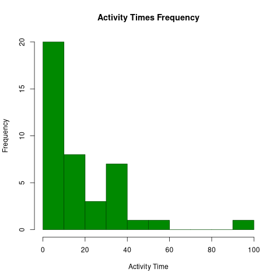
  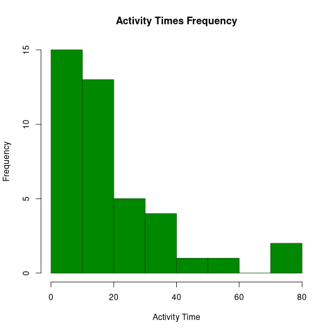
  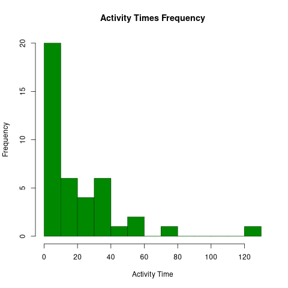
  

  <h5>Waiting Times</h5>
  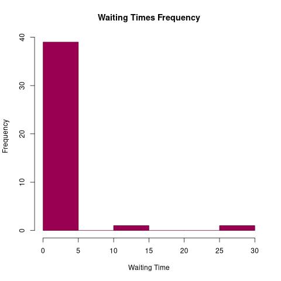
  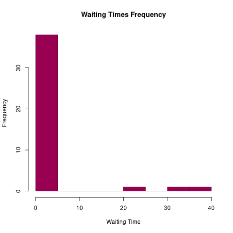
  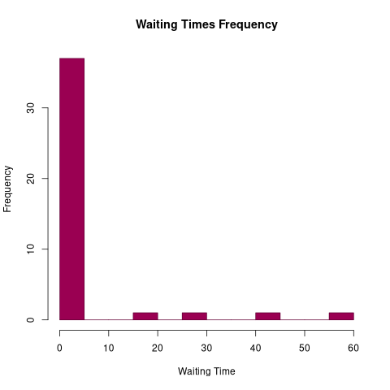
  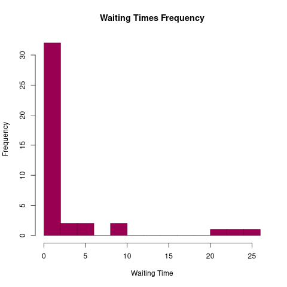
  
  <h5>Total Times</h5>
  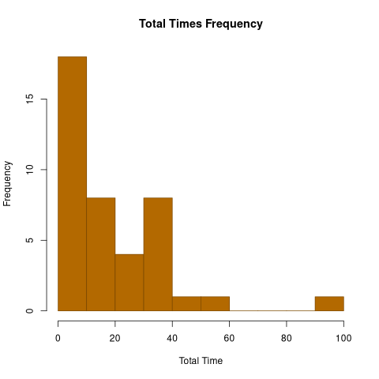
  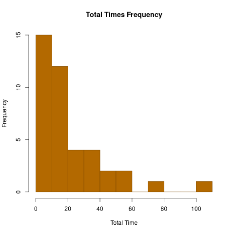
  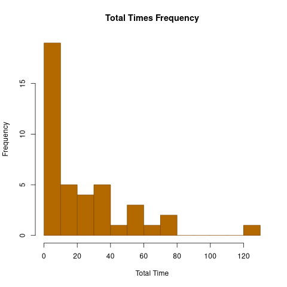
  

  <h5>Total Times - Boxplot</h5>
  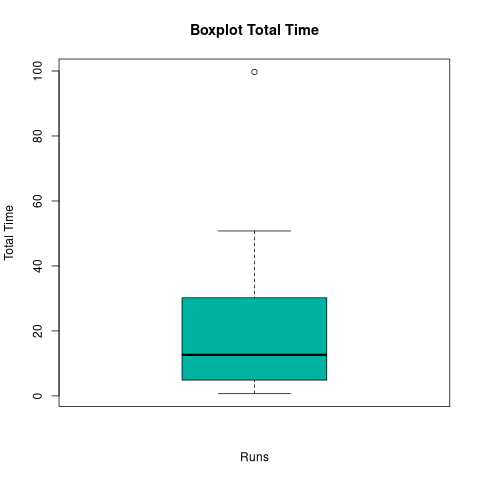
  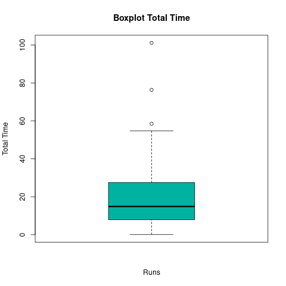
  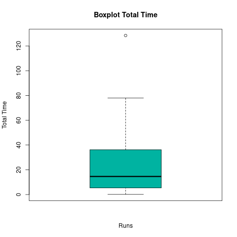
  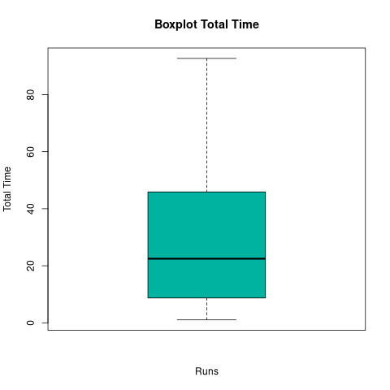
  
  <h5>Resource Usage</h5>
  
  
  
  
  
  <h5>Resource Usage</h5>
  
  
  
  

