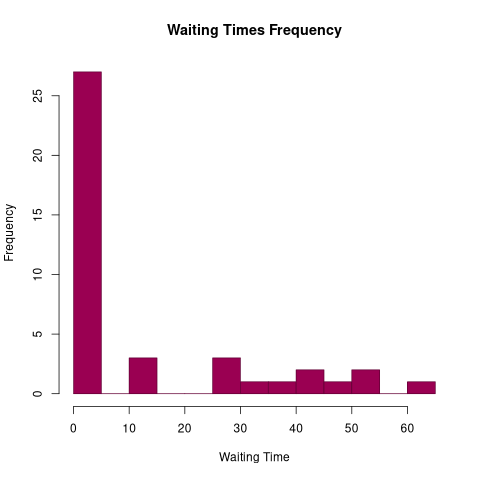
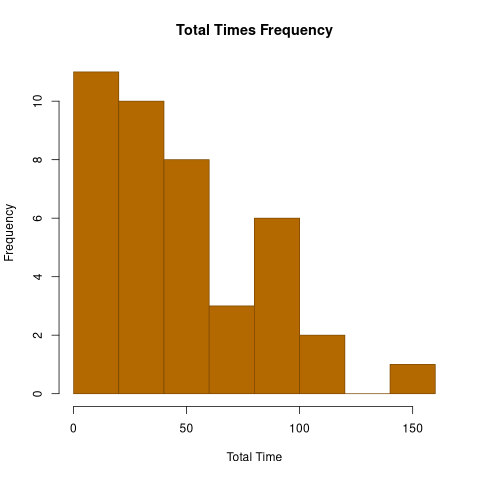

# Airport MM2 Simulation
Simulation of an airport with two lanes and different interarrival rate, assuming a system of M/M/2

# How to Run?

#### Using Docker
- Open `terminal` in current directory.  
- Run the following command to build container  
  `$ docker build -t airport-sim .`

#### Using R-base
- If you have Rlang installed simply run  
  `$ Rscript main.R`

# Final Generated Results

### Reports

[Arrivals data](assets/arrivals.csv)  
[Airport full log](assets/logs.csv)

### Charts

